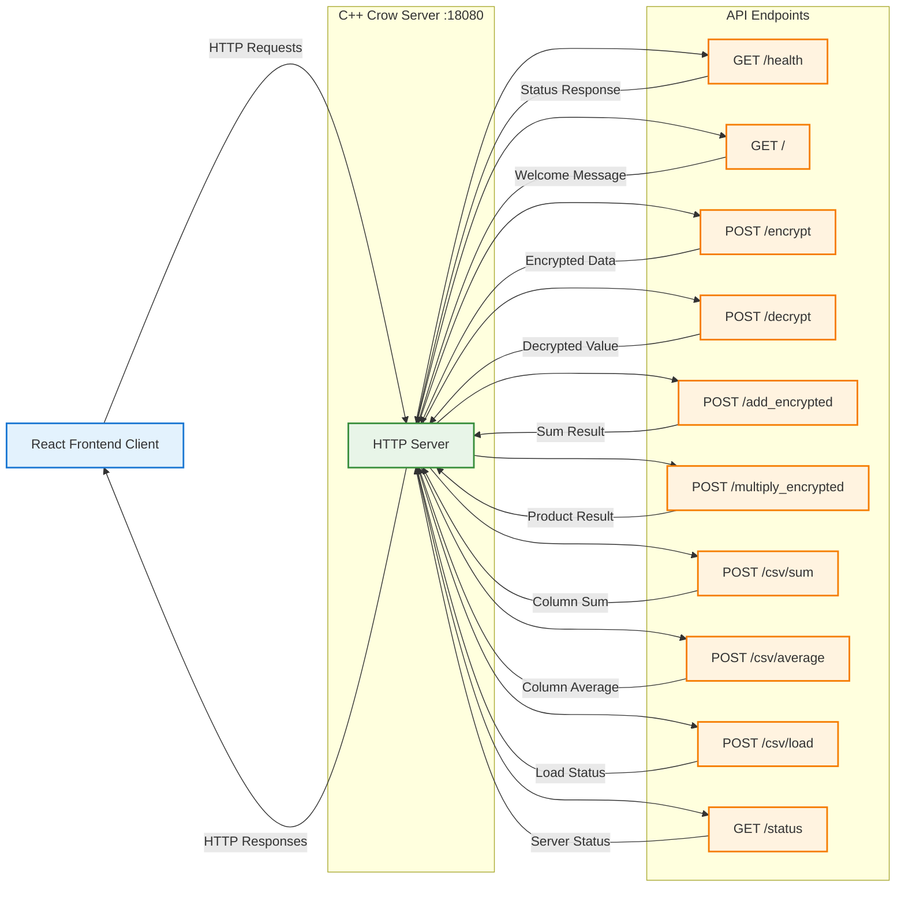

# API Endpoints - Microsoft SEAL Implementation



## Endpoint Details

### Health & Status Endpoints

#### `GET /health`
**Description**: Server health check  
**Response**: 
```json
{
  "status": "healthy",
  "timestamp": "2024-12-10T10:30:00Z",
  "version": "1.0.0"
}
```

#### `GET /`
**Description**: Welcome message and server info  
**Response**: 
```json
{
  "message": "Microsoft SEAL Homomorphic Encryption Server",
  "version": "1.0.0",
  "endpoints": ["/health", "/encrypt", "/decrypt", ...]
}
```

#### `GET /status`
**Description**: Detailed server status  
**Response**: 
```json
{
  "seal_context_initialized": true,
  "csv_data_loaded": true,
  "active_connections": 3,
  "uptime_seconds": 3600
}
```

### Encryption Endpoints

#### `POST /encrypt`
**Description**: Encrypt a single integer value  
**Request Body**: 
```json
{
  "value": 42
}
```
**Response**: 
```json
{
  "encrypted_value": "base64_encoded_ciphertext",
  "success": true
}
```

#### `POST /decrypt`
**Description**: Decrypt a single ciphertext  
**Request Body**: 
```json
{
  "encrypted_value": "base64_encoded_ciphertext"
}
```
**Response**: 
```json
{
  "decrypted_value": 42,
  "success": true
}
```

### Homomorphic Operations

#### `POST /add_encrypted`
**Description**: Add two encrypted values homomorphically  
**Request Body**: 
```json
{
  "encrypted_a": "base64_encoded_ciphertext_1",
  "encrypted_b": "base64_encoded_ciphertext_2"
}
```
**Response**: 
```json
{
  "encrypted_sum": "base64_encoded_result_ciphertext",
  "success": true
}
```

#### `POST /multiply_encrypted`
**Description**: Multiply two encrypted values homomorphically  
**Request Body**: 
```json
{
  "encrypted_a": "base64_encoded_ciphertext_1",
  "encrypted_b": "base64_encoded_ciphertext_2"
}
```
**Response**: 
```json
{
  "encrypted_product": "base64_encoded_result_ciphertext",
  "success": true
}
```

### CSV Data Operations

#### `POST /csv/load`
**Description**: Load healthcare dataset from CSV file  
**Request Body**: 
```json
{
  "filename": "healthcare_dataset.csv"
}
```
**Response**: 
```json
{
  "loaded": true,
  "rows": 1000,
  "columns": 15,
  "success": true
}
```

#### `POST /csv/sum`
**Description**: Calculate encrypted sum of a CSV column  
**Request Body**: 
```json
{
  "column_index": 3,
  "encrypt_result": true
}
```
**Response**: 
```json
{
  "encrypted_sum": "base64_encoded_sum_ciphertext",
  "column_size": 1000,
  "success": true
}
```

#### `POST /csv/average`
**Description**: Calculate encrypted average of a CSV column  
**Request Body**: 
```json
{
  "column_index": 3,
  "encrypt_result": true
}
```
**Response**: 
```json
{
  "encrypted_average": "base64_encoded_average_ciphertext",
  "column_size": 1000,
  "success": true
}
```

## Error Responses

All endpoints return standardized error responses:

```json
{
  "success": false,
  "error": "Error description",
  "error_code": "SEAL_CONTEXT_ERROR",
  "timestamp": "2024-12-10T10:30:00Z"
}
```

## Authentication & Security

- **CORS**: Configured for frontend domain
- **Input Validation**: All requests validated before processing
- **Rate Limiting**: Built-in protection against abuse
- **Error Sanitization**: Sensitive information filtered from error messages
