# Component Structure - Microsoft SEAL Implementation

```mermaid
graph TB
    %% Frontend Layer
    subgraph "Frontend Layer (React + Vite)"
        ReactApp[React Application]
        
        subgraph "React Components"
            AppComponent[App.jsx]
            ExperimentComponent[Experiment.jsx]
            UIComponents[UI Components]
        end
        
        subgraph "Frontend Services"
            APIService[API Service]
            StateManagement[State Management]
            ErrorHandling[Error Handling]
        end
        
        ReactApp --> AppComponent
        ReactApp --> ExperimentComponent
        ReactApp --> UIComponents
        ReactApp --> APIService
        ReactApp --> StateManagement
        ReactApp --> ErrorHandling
    end

    %% Communication Layer
    subgraph "Communication Layer"
        HTTPClient[HTTP Client]
        JSONSerialization[JSON Serialization]
        CORSHandling[CORS Handling]
    end

    %% Backend Layer
    subgraph "Backend Layer (C++ + Crow)"
        CrowApp[Crow Application]
        
        subgraph "Core Backend Components"
            MainBackend[main-backend.cpp]
            APIRoutes[API Routes Handler]
            RequestProcessor[Request Processor]
        end
        
        subgraph "Middleware Components"
            CORSMiddleware[CORS Middleware]
            AuthMiddleware[Authentication Middleware]
            LoggingMiddleware[Logging Middleware]
        end
        
        CrowApp --> MainBackend
        CrowApp --> APIRoutes
        CrowApp --> RequestProcessor
        CrowApp --> CORSMiddleware
        CrowApp --> AuthMiddleware
        CrowApp --> LoggingMiddleware
    end

    %% Encryption Layer
    subgraph "Encryption Layer (Microsoft SEAL)"
        HomomorphicEngine[Homomorphic Encryption Engine]
        
        subgraph "SEAL Core Components"
            SEALContext[SEAL Context]
            KeyGenerator[Key Generator]
            Encryptor[Encryptor]
            Evaluator[Evaluator]
            Decryptor[Decryptor]
            IntegerEncoder[Integer Encoder]
        end
        
        subgraph "Encryption Operations"
            EncryptionOps[Encryption Operations]
            AdditionOps[Addition Operations]
            MultiplicationOps[Multiplication Operations]
            DecryptionOps[Decryption Operations]
        end
        
        HomomorphicEngine --> SEALContext
        HomomorphicEngine --> KeyGenerator
        HomomorphicEngine --> Encryptor
        HomomorphicEngine --> Evaluator
        HomomorphicEngine --> Decryptor
        HomomorphicEngine --> IntegerEncoder
        HomomorphicEngine --> EncryptionOps
        HomomorphicEngine --> AdditionOps
        HomomorphicEngine --> MultiplicationOps
        HomomorphicEngine --> DecryptionOps
    end

    %% Data Layer
    subgraph "Data Layer"
        CSVHandler[CSV Data Handler]
        
        subgraph "Data Processing"
            DataLoader[Data Loader]
            DataValidator[Data Validator]
            ColumnProcessor[Column Processor]
            StatisticsCalculator[Statistics Calculator]
        end
        
        subgraph "Storage"
            HealthcareData[(Healthcare Dataset)]
            ConfigFiles[(Configuration Files)]
            LogFiles[(Log Files)]
        end
        
        CSVHandler --> DataLoader
        CSVHandler --> DataValidator
        CSVHandler --> ColumnProcessor
        CSVHandler --> StatisticsCalculator
        DataLoader --> HealthcareData
        CrowApp --> ConfigFiles
        LoggingMiddleware --> LogFiles
    end

    %% Build System
    subgraph "Build & Deployment"
        CMakeSystem[CMake Build System]
        BuildScripts[Build Scripts]
        Dependencies[Dependencies]
        
        subgraph "External Libraries"
            SEALLibrary[Microsoft SEAL Library]
            CrowLibrary[Crow HTTP Framework]
            AsioLibrary[Asio Networking Library]
        end
        
        CMakeSystem --> BuildScripts
        CMakeSystem --> Dependencies
        Dependencies --> SEALLibrary
        Dependencies --> CrowLibrary
        Dependencies --> AsioLibrary
    end

    %% Inter-layer connections
    APIService <-->|HTTP/JSON| HTTPClient
    HTTPClient <-->|REST API| APIRoutes
    APIRoutes --> RequestProcessor
    RequestProcessor --> HomomorphicEngine
    RequestProcessor --> CSVHandler
    
    %% Build connections
    CrowApp -.->|Built by| CMakeSystem
    HomomorphicEngine -.->|Uses| SEALLibrary
    CrowApp -.->|Uses| CrowLibrary

    %% Styling
    classDef frontend fill:#e3f2fd,stroke:#1976d2,stroke-width:2px
    classDef communication fill:#f3e5f5,stroke:#7b1fa2,stroke-width:2px
    classDef backend fill:#e8f5e8,stroke:#388e3c,stroke-width:2px
    classDef encryption fill:#fff3e0,stroke:#f57c00,stroke-width:2px
    classDef data fill:#fce4ec,stroke:#c2185b,stroke-width:2px
    classDef build fill:#f1f8e9,stroke:#689f38,stroke-width:2px

    class ReactApp,AppComponent,ExperimentComponent,UIComponents,APIService,StateManagement,ErrorHandling frontend
    class HTTPClient,JSONSerialization,CORSHandling communication
    class CrowApp,MainBackend,APIRoutes,RequestProcessor,CORSMiddleware,AuthMiddleware,LoggingMiddleware backend
    class HomomorphicEngine,SEALContext,KeyGenerator,Encryptor,Evaluator,Decryptor,IntegerEncoder,EncryptionOps,AdditionOps,MultiplicationOps,DecryptionOps encryption
    class CSVHandler,DataLoader,DataValidator,ColumnProcessor,StatisticsCalculator,HealthcareData,ConfigFiles,LogFiles data
    class CMakeSystem,BuildScripts,Dependencies,SEALLibrary,CrowLibrary,AsioLibrary build
```

## Architecture Layers

### Frontend Layer (React + Vite)
- **React Application**: Main SPA managing user interface
- **Components**: Modular UI components for different features
- **Services**: API communication and state management utilities

### Communication Layer
- **HTTP Client**: Handles REST API communication
- **JSON Serialization**: Data format conversion
- **CORS Handling**: Cross-origin request management

### Backend Layer (C++ + Crow)
- **Crow Application**: HTTP server framework
- **API Routes**: Endpoint definitions and handlers
- **Middleware**: Request processing pipeline components

### Encryption Layer (Microsoft SEAL)
- **Homomorphic Engine**: Core encryption operations
- **SEAL Components**: Native SEAL library utilities
- **Operations**: Specific homomorphic computations

### Data Layer
- **CSV Handler**: Healthcare data processing
- **Processing Components**: Data validation and transformation
- **Storage**: File system data management

### Build & Deployment
- **CMake System**: C++ build configuration
- **External Libraries**: Third-party dependencies
- **Scripts**: Automated build and deployment tools
