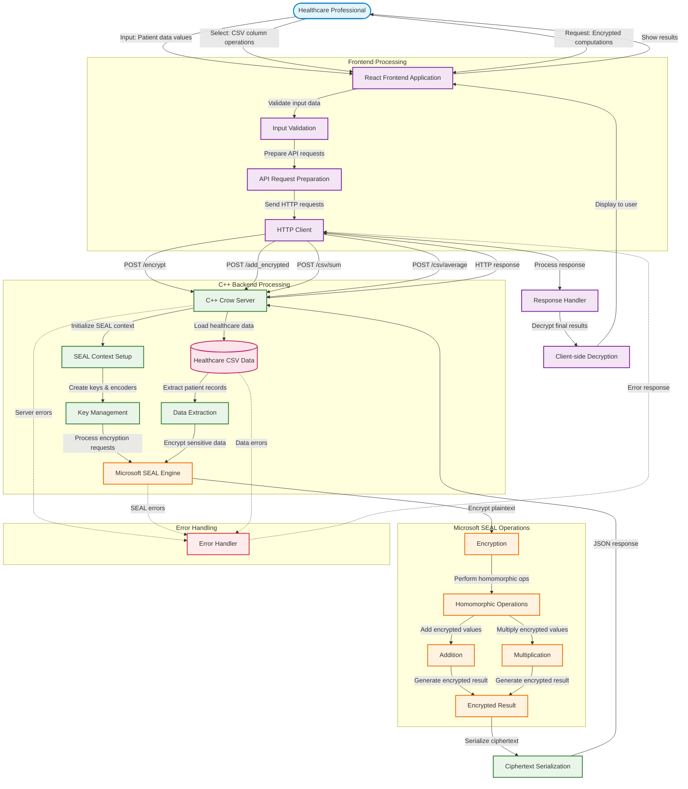

# System Flow - Microsoft SEAL Implementation

## Process Flow Description

### 1. User Interaction Layer
Healthcare professionals interact with the React frontend to:
- Input sensitive patient data values
- Select operations on healthcare datasets
- Request encrypted computations

### 2. Frontend Processing
The React application:
- Validates user input for security
- Prepares API requests with proper formatting
- Manages HTTP communication with backend

### 3. Backend Server (C++ Crow)
The C++ server:
- Receives and routes API requests
- Initializes Microsoft SEAL context and keys
- Loads and processes healthcare CSV data
- Orchestrates encryption/decryption operations

### 4. Microsoft SEAL Engine
The SEAL library:
- Encrypts sensitive healthcare data
- Performs homomorphic operations (addition, multiplication)
- Maintains data privacy throughout computation
- Generates encrypted results

### 5. Data Return Path
Results flow back through:
- Ciphertext serialization for transmission
- JSON response formatting
- HTTP response delivery
- Client-side result processing and display

### Security Features
- End-to-end encryption of sensitive data
- Homomorphic operations preserve privacy
- No plaintext exposure during computation
- Secure key management within SEAL context
