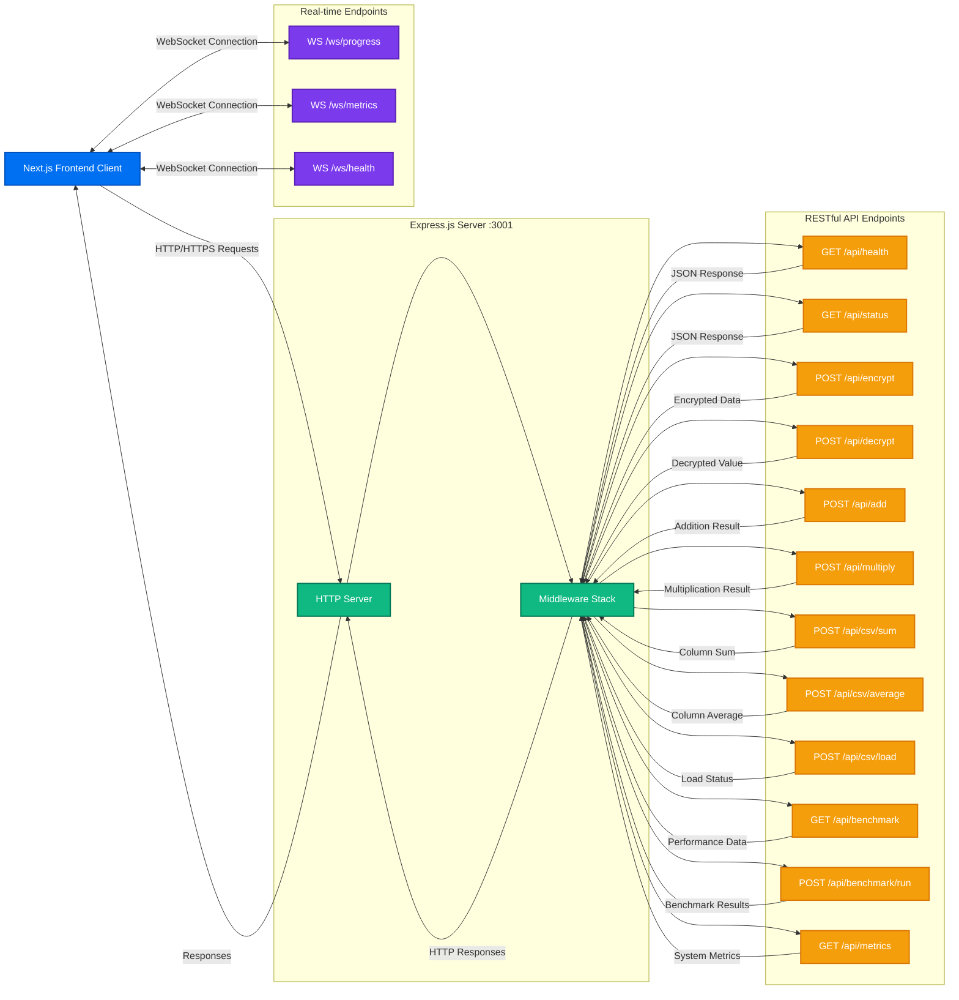

# API Endpoints - Node-SEAL Implementation



## REST API Endpoints

### Health & Status Endpoints

#### `GET /api/health`
**Description**: Basic server health check  
**Response**: 
```json
{
  "status": "healthy",
  "timestamp": "2024-12-10T10:30:00Z",
  "version": "1.0.0",
  "uptime": 3600
}
```

#### `GET /api/status`
**Description**: Detailed application status  
**Response**: 
```json
{
  "seal": {
    "initialized": true,
    "context_valid": true,
    "library_version": "4.1.1"
  },
  "server": {
    "memory_usage": "45.2 MB",
    "cpu_usage": "12.5%",
    "active_connections": 5
  },
  "data": {
    "csv_loaded": true,
    "records_count": 1000,
    "last_updated": "2024-12-10T09:00:00Z"
  }
}
```

#### `GET /api/metrics`
**Description**: Performance metrics and statistics  
**Response**: 
```json
{
  "performance": {
    "avg_encryption_time": 125,
    "avg_decryption_time": 89,
    "avg_addition_time": 45,
    "avg_multiplication_time": 78
  },
  "requests": {
    "total": 1534,
    "success_rate": 99.2,
    "avg_response_time": 156
  }
}
```

### Encryption Endpoints

#### `POST /api/encrypt`
**Description**: Encrypt a single integer value using node-seal  
**Request Body**: 
```json
{
  "value": 42,
  "scheme": "BFV",
  "poly_modulus_degree": 4096
}
```
**Response**: 
```json
{
  "encrypted_value": "base64_encoded_ciphertext_string",
  "success": true,
  "encryption_time_ms": 125,
  "ciphertext_size": 32768
}
```

#### `POST /api/decrypt`
**Description**: Decrypt a ciphertext back to plaintext  
**Request Body**: 
```json
{
  "encrypted_value": "base64_encoded_ciphertext_string"
}
```
**Response**: 
```json
{
  "decrypted_value": 42,
  "success": true,
  "decryption_time_ms": 89
}
```

### Homomorphic Operations

#### `POST /api/add`
**Description**: Perform homomorphic addition on two encrypted values  
**Request Body**: 
```json
{
  "encrypted_a": "base64_encoded_ciphertext_1",
  "encrypted_b": "base64_encoded_ciphertext_2",
  "return_encrypted": true
}
```
**Response**: 
```json
{
  "encrypted_result": "base64_encoded_sum_ciphertext",
  "decrypted_result": 84,
  "success": true,
  "operation_time_ms": 45,
  "noise_budget": 45
}
```

#### `POST /api/multiply`
**Description**: Perform homomorphic multiplication on two encrypted values  
**Request Body**: 
```json
{
  "encrypted_a": "base64_encoded_ciphertext_1",
  "encrypted_b": "base64_encoded_ciphertext_2",
  "return_encrypted": true
}
```
**Response**: 
```json
{
  "encrypted_result": "base64_encoded_product_ciphertext",
  "decrypted_result": 1764,
  "success": true,
  "operation_time_ms": 78,
  "noise_budget": 32
}
```

### Healthcare Data Operations

#### `POST /api/csv/load`
**Description**: Load and validate healthcare dataset  
**Request Body**: 
```json
{
  "filename": "healthcare_dataset.csv",
  "validate_schema": true,
  "encrypt_columns": [2, 3, 5, 7]
}
```
**Response**: 
```json
{
  "loaded": true,
  "records": 1000,
  "columns": 15,
  "encrypted_columns": [2, 3, 5, 7],
  "schema_valid": true,
  "load_time_ms": 245,
  "encryption_time_ms": 1250
}
```

#### `POST /api/csv/sum`
**Description**: Calculate encrypted sum of a healthcare data column  
**Request Body**: 
```json
{
  "column_index": 3,
  "column_name": "patient_age",
  "encrypt_result": true,
  "include_metadata": true
}
```
**Response**: 
```json
{
  "encrypted_sum": "base64_encoded_sum_ciphertext",
  "decrypted_sum": 45230,
  "column_info": {
    "name": "patient_age",
    "index": 3,
    "count": 1000,
    "data_type": "integer"
  },
  "computation_time_ms": 156,
  "success": true
}
```

#### `POST /api/csv/average`
**Description**: Calculate encrypted average of a healthcare data column  
**Request Body**: 
```json
{
  "column_index": 3,
  "column_name": "patient_age",
  "encrypt_result": true
}
```
**Response**: 
```json
{
  "encrypted_average": "base64_encoded_average_ciphertext",
  "decrypted_average": 45.23,
  "column_count": 1000,
  "computation_time_ms": 234,
  "success": true
}
```

### Benchmark Endpoints

#### `GET /api/benchmark`
**Description**: Get current benchmark results and performance data  
**Response**: 
```json
{
  "current_performance": {
    "encryption_ops_per_second": 125,
    "decryption_ops_per_second": 189,
    "addition_ops_per_second": 456,
    "multiplication_ops_per_second": 234
  },
  "last_benchmark": {
    "timestamp": "2024-12-10T09:30:00Z",
    "duration_ms": 10000,
    "operations_tested": 1000
  }
}
```

#### `POST /api/benchmark/run`
**Description**: Execute a new benchmark test  
**Request Body**: 
```json
{
  "operations": ["encrypt", "decrypt", "add", "multiply"],
  "iterations": 100,
  "value_range": [1, 1000],
  "include_csv_operations": true
}
```
**Response**: 
```json
{
  "benchmark_id": "bench_123456",
  "started": true,
  "estimated_duration_ms": 5000,
  "progress_endpoint": "/ws/progress/bench_123456"
}
```

## WebSocket Endpoints

### Real-time Progress Updates

#### `WS /ws/progress`
**Description**: Real-time progress updates for long-running operations  
**Message Format**: 
```json
{
  "operation_id": "bench_123456",
  "progress": 45.5,
  "current_operation": "homomorphic_multiplication",
  "eta_ms": 2500,
  "completed_operations": 455,
  "total_operations": 1000
}
```

#### `WS /ws/metrics`
**Description**: Live performance metrics stream  
**Message Format**: 
```json
{
  "timestamp": "2024-12-10T10:30:15Z",
  "cpu_usage": 23.5,
  "memory_usage": 156.7,
  "operations_per_second": 125,
  "active_connections": 8,
  "queue_length": 3
}
```

#### `WS /ws/health`
**Description**: Real-time health status updates  
**Message Format**: 
```json
{
  "status": "healthy",
  "seal_status": "operational",
  "last_error": null,
  "uptime": 3600,
  "version": "1.0.0"
}
```

## Error Responses

All endpoints return standardized error responses:

```json
{
  "success": false,
  "error": {
    "code": "SEAL_ENCRYPTION_ERROR",
    "message": "Failed to encrypt value: invalid plaintext",
    "details": {
      "value": 42,
      "context": "encryption_operation"
    }
  },
  "timestamp": "2024-12-10T10:30:00Z",
  "request_id": "req_123456"
}
```

## Security & Configuration

### CORS Configuration
- **Allowed Origins**: Frontend development and production URLs
- **Allowed Methods**: GET, POST, OPTIONS
- **Allowed Headers**: Content-Type, Authorization, X-API-Key

### Rate Limiting
- **General Endpoints**: 100 requests per minute per IP
- **Encryption Operations**: 50 operations per minute per IP
- **Benchmark Operations**: 5 requests per minute per IP

### Request Validation
- **Input Sanitization**: All inputs validated and sanitized
- **Type Checking**: TypeScript interfaces ensure type safety
- **Size Limits**: Request body size limited to 10MB
- **Timeout Protection**: Operations timeout after 30 seconds
