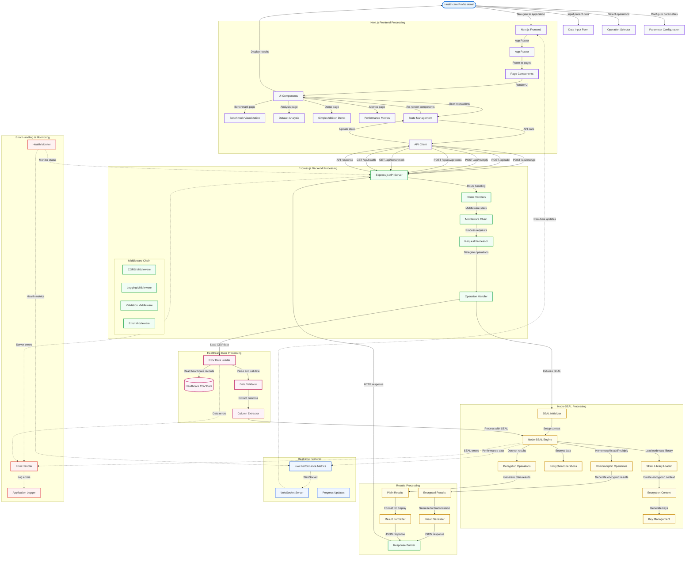

# System Flow - Node-SEAL Implementation

## Process Flow Description

### 1. User Interface Layer (Next.js)
Healthcare professionals interact with a modern web application featuring:
- **App Router**: Next.js 13+ app directory structure with file-based routing
- **Component Hierarchy**: Specialized components for benchmarks, analysis, and demos
- **State Management**: React hooks and context for application state
- **TypeScript**: Full type safety throughout the frontend

### 2. API Communication Layer
- **API Client**: Fetch-based HTTP client with TypeScript interfaces
- **RESTful Design**: Clean API endpoints following REST principles
- **Real-time Updates**: WebSocket integration for live performance metrics
- **Error Handling**: Comprehensive error boundaries and retry logic

### 3. Backend Processing (Express.js)
The Node.js server provides:
- **Express Framework**: Robust HTTP server with middleware support
- **Route Handlers**: Organized endpoint handlers for different operations
- **Middleware Stack**: CORS, logging, validation, and error handling
- **Request Processing**: Structured request validation and response formatting

### 4. Node-SEAL Integration
JavaScript bindings to Microsoft SEAL:
- **Library Loading**: Dynamic loading of node-seal WASM module
- **Context Management**: SEAL context initialization and configuration
- **Key Management**: Automatic key generation and management
- **Operations**: Homomorphic encryption, addition, multiplication, and decryption

### 5. Healthcare Data Processing
Specialized healthcare data handling:
- **CSV Processing**: Robust CSV parsing and validation
- **Data Sanitization**: Healthcare data cleaning and standardization
- **Column Operations**: Statistical operations on encrypted healthcare columns
- **Privacy Preservation**: End-to-end encryption of sensitive medical data

### 6. Real-time Features
Advanced monitoring and feedback:
- **Performance Metrics**: Real-time encryption/decryption performance tracking
- **Progress Updates**: Live updates during long-running operations
- **Health Monitoring**: Server and SEAL engine health status
- **WebSocket Communication**: Bi-directional real-time communication

### Key Advantages of Node-SEAL Implementation
1. **Rapid Development**: JavaScript ecosystem enables faster iteration
2. **Modern UI**: Next.js with advanced React patterns and TypeScript
3. **Component Library**: Radix UI for accessibility and modern design
4. **Developer Experience**: Hot reload, TypeScript IntelliSense, and modern tooling
5. **Deployment Flexibility**: Easy containerization and cloud deployment
